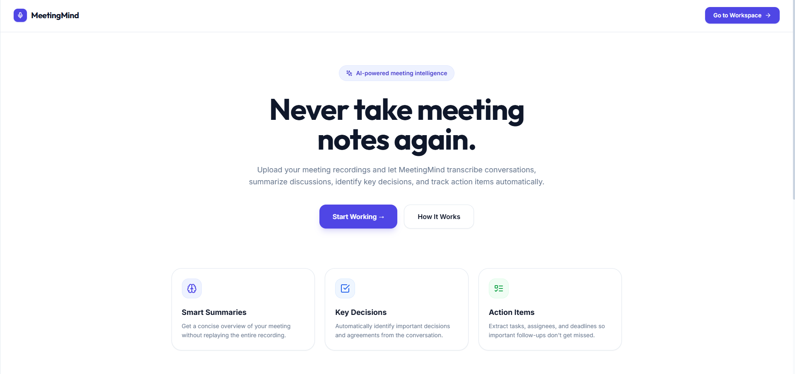
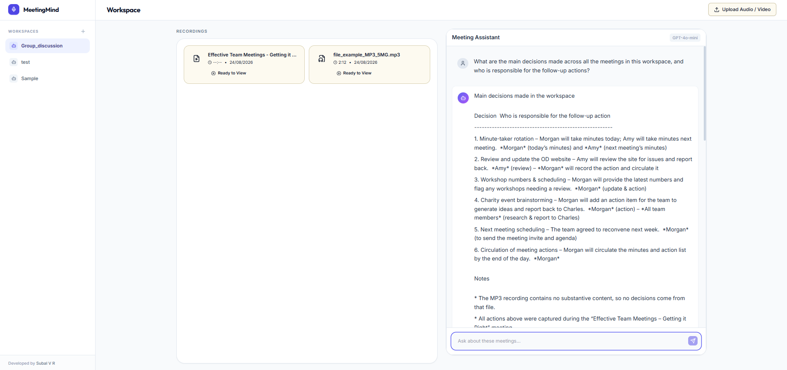
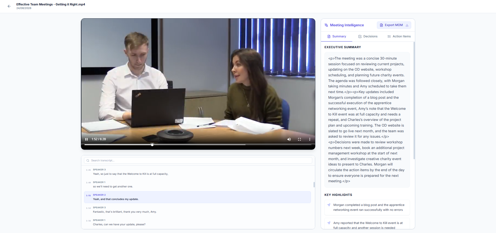
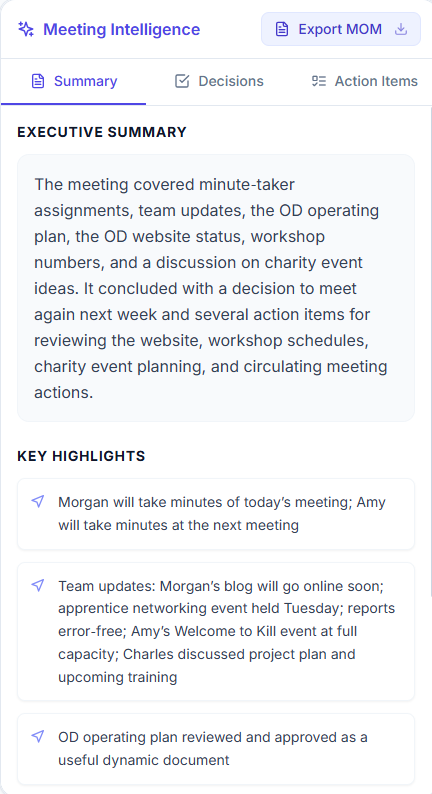
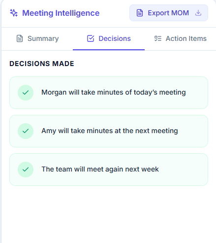
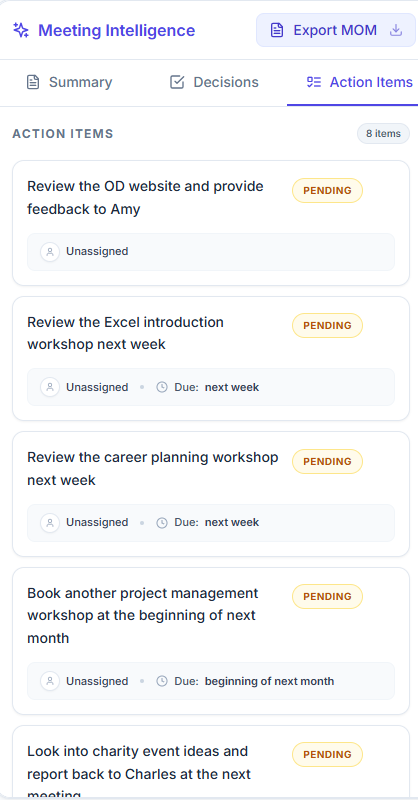
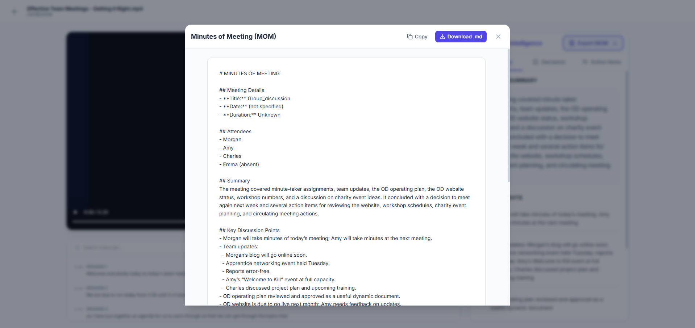

# MeetingMind

MeetingMind is an AI-powered meeting intelligence application designed to seamlessly organize your meetings and automatically extract value from your conversations. Simply upload your audio or video recordings, and MeetingMind will transcribe the meeting, generate an executive summary, extract key decisions, and track actionable items with their respective assignees and deadlines. You can even chat with an AI meeting assistant directly about your meetings, export the Minutes of Meeting (MOM), and organize everything across dedicated workspaces.

## 🖼️ Preview

### Home Page


### Workspace & AI Assistant


### Recording, Video Replay & Transcript


### Meeting Intelligence (Summary, Decisions & Action Items)
<p>
  
  
  
</p>

### Minutes of Meeting (MOM) Export


## ✨ Features

### 🎙️ Audio & Video Processing
- **Format Support:** Upload supported audio and video recordings (MP3, WAV, M4A, OGG, MP4, WebM, MOV)
- **Transcription Engine:** Automatic speech-to-text transcription powered by advanced AI models
- **Live Transcript:** Timestamped and speaker-organized transcript automatically synced to the media player

### 🧠 Meeting Intelligence
- **Executive Summary:** Automatically generates concise meeting overviews
- **Key Highlights:** Points out the most important topics discussed
- **Decision Extraction:** Tracks critical decisions agreed upon by the team
- **Action Item Extraction:** Extracts actionable tasks directly from the conversation

### ✅ Action Item Management
- View extracted action items
- Update and edit action items manually
- Assign action items to team members
- Manage due dates
- Track task status (Pending, In Progress, Completed)

### 💬 AI Meeting Assistant
- Ask questions about recordings and meetings within your workspace
- Uses context from the meeting transcript to provide accurate answers

### 📄 Export
- **Minutes of Meeting (MOM):** Effortlessly export structured meeting notes, intelligence, and decisions directly into a portable document.

### 📂 Workspace Organization
- Create, rename, and manage workspaces to stay organized
- Store multiple recordings inside dedicated workspaces

## 🛠️ Tech Stack

**Frontend:**
- React (18.x)
- Vite
- TypeScript
- Tailwind CSS
- React Router DOM
- Icons provided by Lucide React

**Backend:**
- FastAPI (Python)
- SQLite Database (SQLAlchemy)
- Pydantic (Data validation and settings management)
- Uvicorn (ASGI server)

**AI & Processing:**
- [Groq](https://groq.com) LLM Provider for rapid inference
- Speech-to-Text: `whisper-large-v3-turbo` model for transcription
- Chat & Intelligence: `openai/gpt-oss-20b` or other configured Groq supported chat models

## 🏗️ Project Architecture

```
User
  ↓
React Frontend (Vite + Tailwind)
  ↓
FastAPI Backend
  ├── Workspace Management
  ├── Recording Processing (Background Tasks)
  ├── Transcription Service (Groq Whisper)
  ├── AI Analysis (Groq LLM)
  ├── Meeting Assistant
  └── Action Item Management
  ↓
SQLite Database (SQLAlchemy)
```

## 📁 Project Structure

```
MeetingMind/
├── backend/
│   ├── app/
│   │   ├── api/
│   │   │   └── routes/      # Endpoints (workspaces, recordings, chat)
│   │   ├── core/
│   │   ├── database/
│   │   ├── schemas/         # Pydantic validation models
│   │   └── services/        # AI orchestration and processing logic
│   ├── uploads/             # Temporary folder for media uploads
│   └── requirements.txt
├── frontend/
│   ├── src/
│   │   ├── components/      # UI components (Intelligence, Layout, Player, Workspace)
│   │   ├── pages/           # Application views (Home, Recording, Workspace)
│   │   ├── services/        # APIs
│   │   └── types/           # Global TypeScript definitions
│   ├── package.json
│   ├── tailwind.config.js
│   └── index.html
├── images/                  # Repository preview images
└── README.md
```

## 🚀 Local Setup and Installation

### Prerequisites
Make sure you have the following installed on your machine:
- Node.js (v18+ recommended)
- Python (v3.9+ recommended)
- pip
- Git
- A [Groq API Key](https://console.groq.com/keys)

### Clone the repository

```bash
git clone https://github.com/subal-v-r/meetingmind.git
cd meetingmind
```

### Backend Setup

1. Navigate to the backend directory:
   ```bash
   cd backend
   ```
2. Create and activate a Python virtual environment:
   ```bash
   python -m venv venv
   # On Windows
   venv\Scripts\activate
   # On macOS/Linux
   source venv/bin/activate
   ```
3. Install Python dependencies:
   ```bash
   pip install -r requirements.txt
   ```
4. Set up environment variables:
   Copy `.env.example` to `.env` and insert your API keys:
   ```bash
   cp .env.example .env
   ```
   *Required Keys in `.env`:*
   ```env
   GROQ_API_KEY=your_groq_api_key_here
   GROQ_WHISPER_MODEL=whisper-large-v3-turbo
   GROQ_LLM_MODEL=openai/gpt-oss-20b
   ```
5. Start the FastAPI development server:
   ```bash
   uvicorn app.main:app --reload --port 8000
   ```
   The backend should now be running at `http://localhost:8000`.

### Frontend Setup

1. Open a new terminal and navigate to the frontend directory:
   ```bash
   cd frontend
   ```
2. Install Node dependencies:
   ```bash
   npm install
   ```
3. Set up frontend environment variables (optional):
   ```bash
   cp .env.example .env
   ```
4. Start the React development server:
   ```bash
   npm run dev
   ```
5. Open your browser and navigate to `http://localhost:5173` to launch MeetingMind!
